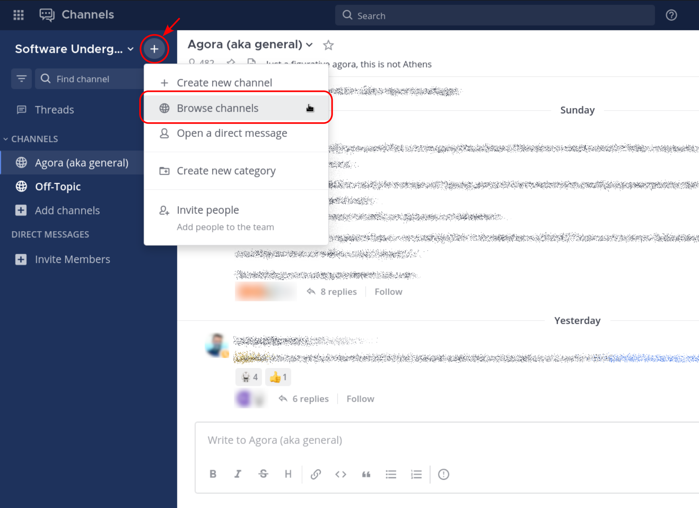

# Software Underground's Mattermost instance

## About

[Mattermost][mattermost] is an open-source chat software that anyone can
[self-host][selfhosting]. It can be considered as an open-source alternative to
services like Slack or Microsoft Teams.

Since October 2023, Software Underground hosts its own Mattermost instance
where the members of its community can interact.

### What is this repo?

This repository contains files regarding the configuration and maintenance of
the [Software Underground's Mattermost instance][mattermost.swung].

## Getting started

If you would like to join to our instance, you first need to [create an
account][create-account].

### Exploring channels

Once you created an account, you'll be automatically added to a few channels,
like [Agora (aka general)][general] and Off-Topic.
But there are many more channels that you probably would like to join.

To join more channels, click on the **+** button on the top part of the panel
on the left, and then choose **Browse channels**.



It will open a pop-up window with a list of the existing channels. By clicking
in **Join** you can join to any channel you want.


### Desktop and Mobile Apps

Besides using Mattermost from your browser, you can install [Mobile and Desktop
Apps][mattermost.apps].

After you install either of those, they will ask you which server you want to
login to:

- The **Server URL** is the URL of the Mattermost server we want to login to, in
this case: `mattermost.softwareunderground.org`.
- The **Display Name** is just the name that will be used to list this
  particular server in your list of servers. You can choose anything you want
  for this, like `Software Underground`.


### More information

- Mattermost documentation: https://docs.mattermost.com/guides/use-mattermost.html


## Creating polls

In March 2025 we installed the [`matterpoll`][matterpoll] plugin that allow us
to create polls directly in Mattermost channels.

A poll can be created by any user using the `/poll` command followed by the
question and the options users can choose from. For example:

```
/poll "Is Matterpoll great?" "I love it" "Strongly agree" "Yes, sure"
```

> [!TIP]
> When creating a poll, post a new message with just the instruction to create
> the poll. Including the poll command at the end of a regular Markdown post
> won't create the poll.

Polls can be configured to be anonymous, to show the voting results while the
poll is still running, to allow users to vote more than one option or add their
own custom option. Refer to [`matterpoll`][matterpoll] documentation on how to
configure your poll.


## Found a bug?

If you run into any issue while using our Mattermost instance, feel free to
leave a comment in the [~swung-mattermost][swung-mattermost.channel] channel or
[open an Issue in this repository][open-issue].


[open-issue]: https://github.com/softwareunderground/mattermost/issues/new/choose
[swung-mattermost.channel]: https://mattermost.softwareunderground.org/swung/channels/swung-mattermost
[mattermost.apps]: https://mattermost.com/apps/
[general]: https://mattermost.softwareunderground.org/swung/channels/town-square
[mattermost.swung]: https://mattermost.softwareunderground.org
[create-account]: https://mattermost.softwareunderground.org/signup_user_complete
[mattermost]: https://mattermost.com/
[selfhosting]: https://en.wikipedia.org/wiki/Self-hosting_(web_services)
[matterpoll]: https://github.com/matterpoll/matterpoll
